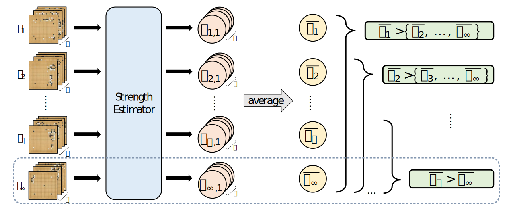

# Strength Estimation and Human-Like Strength Adjustment in Games

This is the official repository of the ICLR 2025 paper [Strength Estimation and Human-Like Strength Adjustment in Games](https://rlg.iis.sinica.edu.tw/papers/strength-estimator).

If you use this work for research, please consider citing our paper as follows:
```
@inproceedings{
    chen2025strength,  
    title={Strength Estimation and Human-Like Strength Adjustment in Games},
    author={Chen, Chun-Jung and Shih, Chung-Chin and Wu, Ti-Rong},
    booktitle={International Conference on Learning Representations},
    year={2025},
    url={https://openreview.net/forum?id=CvjXlsBLCX}
}
```



This repository is built upon [MiniZero](https://github.com/rlglab/minizero). We add chess game from [LeelaChessZero](https://github.com/LeelaChessZero/lc0). The following instructions are prepared for reproducing the main experiments in the paper.

## Training Strength Estimator

### Prerequisites
The program requires a Linux operating system with a container installed and at least one NVIDIA GPU to operate.

### Build Programs

Clone this repository with the required submodules:
```bash
git clone --recursive git@github.com:rlglab/strength-estimator.git
cd strength-estimator
```

Enter the container to build the required executables:
```bash
# start the container
./scripts/start-container.sh

# run the below commands to build programs inside the container
./scripts/build.sh go       # for Go
./scripts/build.sh chess    # for chess
```

### Preprocessing Game Records
We provide the downloading and preprocessing of game records used in the paper. You are welcome to use game records from other sources as long as they follow the format described below.

#### Go
Visit the [Fox Weiqi website](https://www.foxwq.com/soft.html) to download the FoxWeiqi application. Then, install and log in to your account and select the games you want to download and save them as `.sgf` files.
```bash
# create a directory named training_sgf_go
mkdir training_sgf_go

# arrange .sgf files in the following structure:
training_sgf_go/
├── 3-5k.sgf
├── 1-2k.sgf
│   ...
└── 9d.sgf
```
> [!NOTE]
> Each game records must be **in one line** and in the form of [Smart Game Format](https://www.red-bean.com/sgf/) and contain tags `BR` and `WR` in English (e.g. if you download the game records from FoxWeiqi, you need to first transfer "級" into "k" and "段" into "d") to indicate the ranks of both players. To reproduce the main experiment in the paper, you should prepapre 11 ranks (3-5k, 1-2k, 1d, 2d, ... , 9d) of game records in directory.

#### chess
<a id="preprocess"></a>
Visit [Lichess](https://database.lichess.org/) and download the .pgn.zst file.

```bash
# create a directory named download_chess_game with subfolders for 2023 and 2024 games
mkdir download_chess_game
mkdir download_chess_game/database2023
mkdir download_chess_game/database2024

# extract the .pgn.zst Files and arrange the extracted .pgn files in the following structure:
download_chess_game/
├── database2024/
│   ├── lichess_db_standard_rated_2024-01.pgn
│   └── lichess_db_standard_rated_2024-02.pgn
└── database2023/
    ├── lichess_db_standard_rated_2023-09.pgn
    ├── ...
    └── lichess_db_standard_rated_2023-12.pgn

# run the script to preprocess game records
./scripts/preprocess_games.sh

# you will obtain the following directory structure in current directory after executing the above command
training_sgf_chess/
├── 1000_1200.txt       
│   ...
├── 2400_2600.txt
candidate_sgf_chess/
├── 1000_1200.txt         
│   ...
├── 2400_2600.txt
query_sgf_chess/
├── 1000_1200.txt         
│   ...
└── 2400_2600.txt
```

To reproduce the main experiment in the paper, you should prepapre 8 ranks (elo 1000-1199, 1200-1399, ... , and 2400-2599) of game records.


### Train Strength Estimator

To reproduce the strength estimator models of $\texttt{SE}$, $\texttt{SE}_{\infty}$, and $\texttt{SL}$ (the baseline model), simply use the following commands:
```bash
# For Go
./scripts/train.sh go cfg/sl_go.cfg                 # Train SL
./scripts/train.sh go cfg/se_go.cfg                 # Train SE
./scripts/train.sh go cfg/se_infty_go.cfg           # Train SE_∞

# For chess
./scripts/train.sh chess cfg/sl_chess.cfg           # Train SL
./scripts/train.sh chess cfg/se_chess.cfg           # Train SE
./scripts/train.sh chess cfg/se_infty_chess.cfg     # Train SE_∞
```

You will obtain a folder with the following structure:
```bash
# The following is an example for training SE_∞ in Go
go_19x19_bt_b32_r12_p7_20bx256-2a0d91/
├── go_19x19_bt_b32_r12_p7_20bx256-2a0d91.cfg  # configuration file
├── model/                                     # model snapshots
│   ├── weight_iter_*.pkl                      # include training step, parameters, optimizer, sc  
│   └── weight_iter_*.pt                       # model parameters only (use for testing)
└── op.log                                     # the optimization log
```

<details><summary>You are welcome to adjust training parameters in configuration files.</summary>

```bash
learner_batch_size=2688    # total taining positions for one training step, it must equal to bt_num_batch_size * bt_num_rank_per_batch * bt_num_position_per_rank 
learner_learning_rate=0.01 # hyperparameter for initial learning rate
nn_num_blocks=20           # hyperparameter for the model; the number of the residual blocks
bt_num_batch_size=32       # numbers of training batch for one training step 
bt_num_rank_per_batch=12   # the numbers of ranks chosen in one training batch
bt_num_position_per_rank=7 # the number of positions chosen for each rank in one training batch
```
</details>

To reproduce the experiments for section 4.4, adjust the `training_sgf_go/` directory to contain only game records with 1D and 9D for the 2-rank dataset, and 1D, 5D, and 9D for the 3-rank dataset. Then, modify the following configurations in `cfg/se_infty_go.cfg` and use the same training command to train $\texttt{SE}_{\infty}$ with limited data:
```bash
# For 2-rank dataset
learner_batch_size=448
bt_num_rank_per_batch=2

# For 3-rank dataset
learner_batch_size=672
bt_num_rank_per_batch=3

# training command
./scripts/train.sh go cfg/se_infty_go.cfg
```


## Evaluation

### Preparing Game Records
#### Go
To reproduce the paper result, collect at least 100 games of each rank for candidate, i.e. total 100 $\times$ 11(ranks) = 1100 games and at least 900 games of each rank for query, i.e. total 900 $\times$ 11(ranks) = 9900 games.

```bash
# create two directories for candidate and query dataset
mkdir candidate_sgf_go
mkdir query_sgf_go

# arrange .sgf files in the same structure with training:
mv [your_go_game_candidate_dataset.sgf] candidate_sgf_go/
mv [your_go_game_query_dataset.sgf] query_sgf_go/
```
> [!NOTE]
> Each game records must be **in one line** and in the form of [Smart Game Format](https://www.red-bean.com/sgf/) and contain tags `BR` and `WR` in English (e.g. if you download the game records from FoxWeiqi, you need to first transfer "級" into "k" and "段" into "d") to indicate the ranks of both players. To reproduce the main experiment in the paper, you should prepapre 11 ranks (3-5k, 1-2k, 1d, 2d, ... , 9d) of game records in directory.

#### chess
You can skip this step if you use the method mentioned in [preprocess](#preprocess).

### Predicting Accuracy of Strength Estimation 
Run the following commands:
```bash
# For Go (in subsection 4.2)
./build/go/strength_go -conf_file cfg/se_go.cfg -mode evaluator                 # SE
./build/go/strength_go -conf_file cfg/se_infty_go.cfg -mode evaluator           # SE_∞
./build/go/strength_go -conf_file cfg/sl_sum_go.cfg -mode evaluator             # SL_sum
./build/go/strength_go -conf_file cfg/sl_vote_go.cfg -mode evaluator            # SL_vote

# For Go (in subsection 4.4)
./build/go/strength_go -conf_file cfg/se_infty_go_2_rank.cfg -mode evaluator    # 2 rank
./build/go/strength_go -conf_file cfg/se_infty_go_3_rank.cfg -mode evaluator    # 3 rank

# For chess (in subsection 4.5)
./build/chess/strength_chess -conf_file cfg/se_chess.cfg -mode evaluator        # SE
./build/chess/strength_chess -conf_file cfg/se_infty_chess.cfg -mode evaluator  # SE_∞
./build/chess/strength_chess -conf_file cfg/sl_sum_chess.cfg -mode evaluator    # SL_sum
./build/chess/strength_chess -conf_file cfg/sl_vote_chess.cfg -mode evaluator   # SL_vote
```

After running the above commands, the program will output a table like the following:
```
	-1	0	1	2	3	4	5	6	7	8	9	all
1	0.525	0.365	0.485	0.255	0.22	0.225	0.38	0.385	0.365	0.235	0.66	0.372727
2	0.545	0.46	0.58	0.505	0.365	0.37	0.34	0.415	0.445	0.39	0.69	0.464091
...
100	0.915	1	1	1	0.995	0.965	1	0.995	1	0.945	1	0.983182
```

* Row: Each row represents the results obtained when querying a specific number of games.
* Column: `-1` to `9`: The evaluation results for different ranks (-1 corresponds to $r_{11}$, 0 to $r_{10}$, ..., 9 to $r_1$). `all`: The average evaluation score across all ranks.

If you want to use a specific model snapshot, modify the value of `nn_file_name` in the configure file to the model path. e.g., `nn_file_name=./go_19x19_bt_b32_r12_p7_20bx256-2a0d91/model/weight_iter_*.pt`.

### Strength Adjustment
For $\texttt{SE-MCTS}$ or $\texttt{SE}_{\infty}\texttt{-MCTS}$:
The desired ranked of the program is according to the `candidate_sgf_dir` in configure file, i.e. to adjust to the desired ranking, adjust the setting of the configure file.
```bash
# adjust to 4d in Go
candidate_sgf_dir=candidate_sgf_go/4D.sgf

# adjust to 1400-1599 elo rating in chess
candidate_sgf_dir=candidate_sgf_chess/1400_1599.txt
```

For $\texttt{SA-MCTS}$: The desired ranked of the program is according to the $z$ (check $z$ values in appendix C in paper). Modify `actor_select_action_softmax_temperature` in configuration file `cfg/sa_go_mcts.cfg`.
```bash
# adjust to 4d in Go 
actor_select_action_softmax_temperature=0.15 
```

To evaluate the move accuracy of the specific rank, adjust the setting `testing_sgf_dir` of the configure file.
```bash
# evaluate the move accuracy of 4d in Go
testing_sgf_dir=candidate_sgf_go/4D.sgf

# evaluate the move accuracy of elo 1400-1599 in chess
testing_sgf_dir=candidate_sgf_chess/1400_1599.txt
```

Commands for reproducing experiments:
```bash
# For Go (in subsection 4.3)
./build/go/strength_go -conf_file cfg/se_go_mcts.cfg -mode mcts_acc                 # SE-MCTS
./build/go/strength_go -conf_file cfg/se_infty_go_mcts.cfg -mode mcts_acc           # SE∞-MCTS
./build/go/strength_go -conf_file cfg/sa_go_mcts.cfg -mode mcts_acc                 # SA-MCTS

# For chess (in subsection 4.5)
./build/chess/strength_chess -conf_file cfg/se_chess_mcts.cfg -mode mcts_acc        # SE-MCTS
./build/chess/strength_chess -conf_file cfg/se_infty_chess_mcts.cfg -mode mcts_acc  # SE∞-MCTS
./build/chess/strength_chess -conf_file cfg/sa_chess_mcts.cfg -mode mcts_acc        # SA-MCTS
```

The program will output accuracy results for different simulation counts and various $z$ values, as an example below.
```bash
simulation: 1, mcts accuracy: 4% (2/50), ssa_-2 accuracy: 4% (2/50), ssa_-1 accuracy: 4% (2/50), ...
simulation: 2, mcts accuracy: 4% (2/50), ssa_-2 accuracy: 18% (9/50), ssa_-1 accuracy: 32% (16/50), ...
simulation: 3, mcts accuracy: 4% (2/50), ssa_-2 accuracy: 24% (12/50), ssa_-1 accuracy: 18% (9/50), ...
```

* Simulation: The number of simulation counts used in MCTS.
* MCTS Accuracy: The accuracy of the search-based result without applying SA-MCTS. The accuracy will be $\texttt{SE-MCTS}$ accuracy when using the $\texttt{SE}$ model, and it will be MCTS accuracy when using SA-MCTS.
* SSA Accuracy: The accuracy when using SA-MCTS with different $z$ values.
